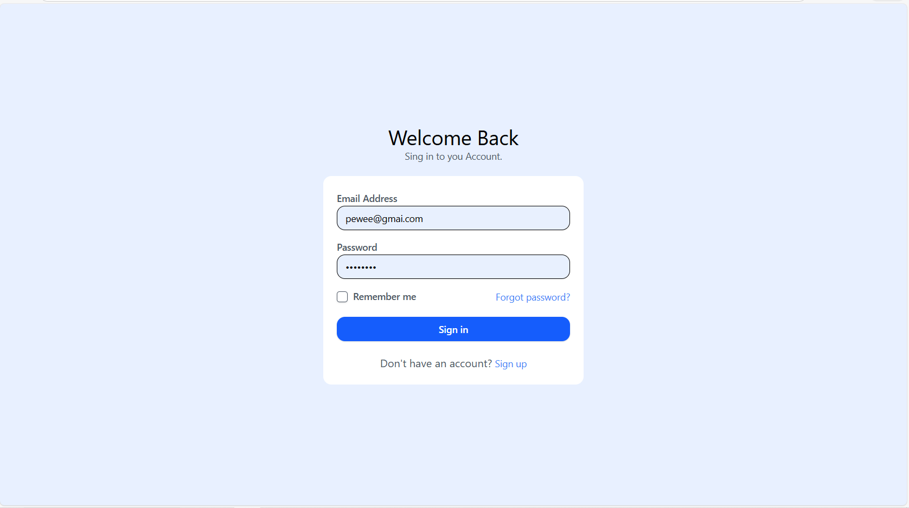
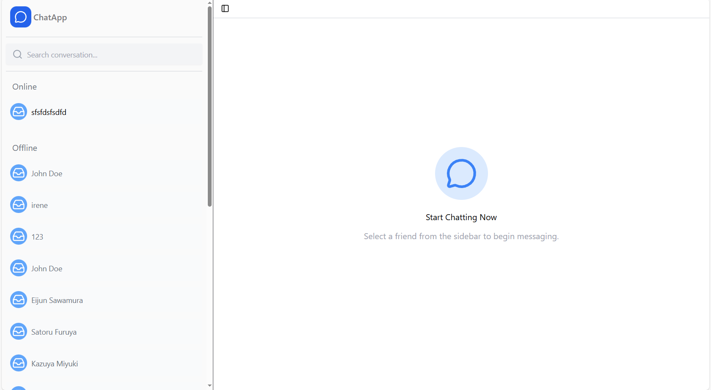
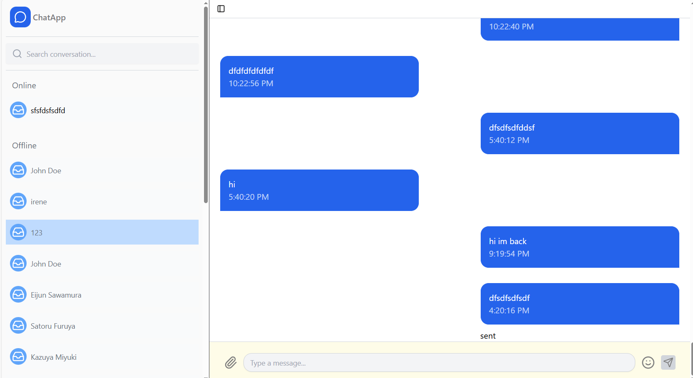
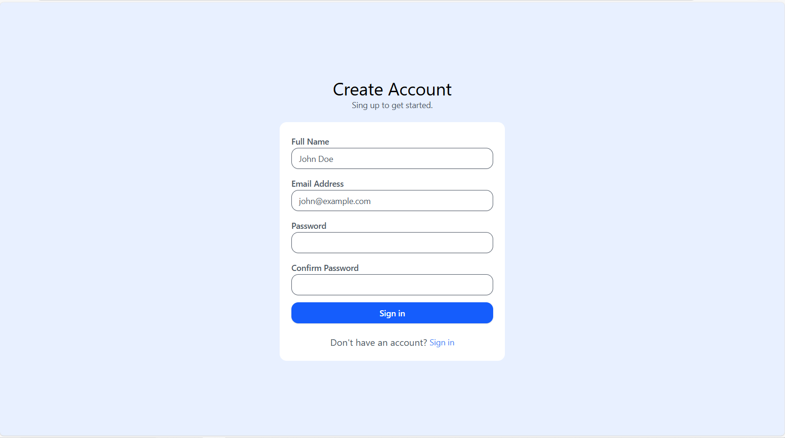

# Real-Time Chat Application

A full-stack real-time messaging system built with **React**, **Node.js**, **Express**, and **Socket.io**, featuring secure authentication and live communication between users.

---

##  Overview
This application allows users to communicate instantly in real-time with authentication, message status tracking, and a responsive user interface.

---

##  Features

-  Real-time messaging using Socket.io
-  Read receipts (seen/unseen message status)
-  Secure authentication using JWT stored in HttpOnly cookies
-  User login and registration system
-  Persistent chat sessions between users
-  Responsive and user-friendly UI

---

##  Tech Stack

**Frontend:**
- React
- Tailwind CSS

**Backend:**
- Node.js
- Express.js
- JWT Authentication (Cookie-based sessions)

**Real-Time Layer:**
- Socket.io

**Database:**
- MongoDB

---

##  Demo
Live walkthrough of the application:  
 https://youtu.be/q3eddtQeh0U

---

##  Screenshots

**Login Page**

**Home Page**

**Chat Interface**

**Register Page**

---

##  How It Works

- Users register and log in securely using JWT authentication
- Auth tokens are stored in HttpOnly cookies for security
- Once authenticated, users can join real-time chat sessions
- Messages are instantly delivered using Socket.io
- Read receipts update message status in real time

---

##  Future Improvements

- Emoji support 
- File and image sharing
- Typing indicators
- Message timestamps in human-readable format (e.g. “2 hours ago”)
